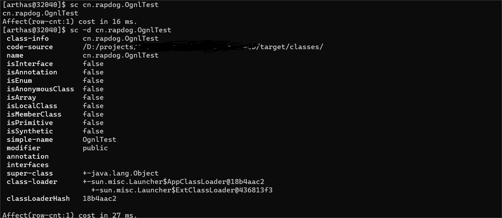

# Arthas使用说明

[TOC]

## 一、简介

### Arthas项目地址

[GitHub](https://github.com/alibaba/arthas)

```
https://github.com/alibaba/arthas
```

[码云](http://arthas.gitee.io/)

```
http://arthas.gitee.io/
```

*以下是Arthas官网介绍*

> # 简介
>
> 
>
> Arthas 是一款线上监控诊断产品，通过全局视角实时查看应用
> load、内存、gc、线程的状态信息，并能在不修改应用代码的情况下，对业务问题进行诊断，包括查看方法调用的出入参、异常，监测方法执行耗时，类加载信息等，大大提升线上问题排查效率。
>
> ## 背景
>
> 通常，本地开发环境无法访问生产环境。如果在生产环境中遇到问题，则无法使用 IDE 远程调试。更糟糕的是，在生产环境中调试是不可接受的，因为它会暂停所有线程，导致服务暂停。
>
> 开发人员可以尝试在测试环境或者预发环境中复现生产环境中的问题。但是，某些问题无法在不同的环境中轻松复现，甚至在重新启动后就消失了。
>
> 如果您正在考虑在代码中添加一些日志以帮助解决问题，您将必须经历以下阶段：测试、预发，然后生产。这种方法效率低下，更糟糕的是，该问题可能无法解决，因为一旦
> JVM 重新启动，它可能无法复现，如上文所述。
>
> Arthas 旨在解决这些问题。开发人员可以在线解决生产问题。无需 JVM 重启，无需代码更改。 Arthas 作为观察者永远不会暂停正在运行的线程。
>
> ## Arthas（阿尔萨斯）能为你做什么？
>
> `Arthas` 是 Alibaba 开源的 Java 诊断工具，深受开发者喜爱。
>
> 当你遇到以下类似问题而束手无策时，`Arthas`可以帮助你解决：
>
> 1. 这个类从哪个 jar 包加载的？为什么会报各种类相关的 Exception？
> 2. 我改的代码为什么没有执行到？难道是我没 commit？分支搞错了？
> 3. 遇到问题无法在线上 debug，难道只能通过加日志再重新发布吗？
> 4. 线上遇到某个用户的数据处理有问题，但线上同样无法 debug，线下无法重现！
> 5. 是否有一个全局视角来查看系统的运行状况？
> 6. 有什么办法可以监控到 JVM 的实时运行状态？
> 7. 怎么快速定位应用的热点，生成火焰图？
> 8. 怎样直接从 JVM 内查找某个类的实例？
>
> `Arthas` 支持 JDK 6+，支持 Linux/Mac/Windows，采用命令行交互模式，同时提供丰富的 `Tab` 自动补全功能，进一步方便进行问题的定位和诊断。

## 二、 安装&启动

### 使用`arthas-boot`（推荐）

1. ### 安装

   绿色软件，直接下载即可直接启动

   [下载地址](https://arthas.aliyun.com/arthas-boot.jar)

   ```
   https://arthas.aliyun.com/arthas-boot.jar
   ```

2. ### 启动

   启动命令

   ```bash
   java -jar arthas-boot.jar
   ```

   若使用过程中遇到中文乱码，可在启动命令指定编码格式

   ```shell
   java -jar -Dfile.encoding=UTF-8 arthas-boot.jar
   
   java -jar -Dfile.encoding=gbk arthas-boot.jar
   ```

3. ### 挂载到java进程

   arthas启动后，选择需要挂载的java进程序号

```shell
[root@xxx ~]java -jar .\arthas-boot.jar
[INFO] JAVA_HOME: /opt/Java/jdk-11
[INFO] arthas-boot version: 3.6.9
[INFO] Found existing java process, please choose one and input the serial number of the process, eg : 1. Then hit ENTER.
* [1]: 26868 com.ai.UnidocWebStartup
  [2]: 15232 org.jetbrains.idea.maven.server.RemoteMavenServer36
  [3]: 20000 org.jetbrains.idea.maven.server.RemoteMavenServer36
  [4]: 3984 org.apache.zookeeper.server.quorum.QuorumPeerMain
  [5]: 9936
  [6]: 10468 org.jetbrains.jps.cmdline.Launcher
  [7]: 23480 org.jetbrains.idea.maven.server.RemoteMavenServer36
  [8]: 11324 com.cmcc.unidoc.UnidocServerStartup
  
 1
    ,---.  ,------. ,--------.,--.  ,--.  ,---.   ,---.
 /  O  \ |  .--. ''--.  .--'|  '--'  | /  O  \ '   .-'
|  .-.  ||  '--'.'   |  |   |  .--.  ||  .-.  |`.  `-.
|  | |  ||  |\  \    |  |   |  |  |  ||  | |  |.-'    |
`--' `--'`--' '--'   `--'   `--'  `--'`--' `--'`-----'

wiki       https://arthas.aliyun.com/doc
tutorials  https://arthas.aliyun.com/doc/arthas-tutorials.html
version    3.6.9
main_class
pid        26868
time       2023-11-17 16:12:03

[arthas@26868]$
```

## 三、 使用

### 基础命令

| 序号 | 命令        | 说明                                                                 |
|----|-----------|--------------------------------------------------------------------|
| 1  | `help`    | 查看arthas命令帮助信息，可在其他命令后加-h参数查看该命令的参数信息                              |
| 2  | `keymap`  | `keymap`命令输出当前的快捷键映射表                                              |
| 3  | `cat`     | 显示文本文件内容                                                           |
| 4  | `grep`    | 过滤内容，和 linux 命令类似                                                  |
| 5  | `pwd`     | 返回当前的工作目录，和 linux 命令类似                                             |
| 6  | `session` | 查看当前会话的信息，显示当前绑定的 pid 以及会话 id                                      |
| 7  | `history` | 打印命令历史                                                             |
| 8  | `cls`     | 清空当前屏幕区域                                                           |
| 9  | `reset`   | 重置增强类，将被 Arthas 增强过的类全部还原，Arthas 服务端`stop`时会重置所有增强过的类              |
| 10 | `quit`    | 退出当前 Arthas 客户端，其他 Arthas 客户端不受影响。等同于**exit**、**logout**、**q**三个指令 |
| 11 | `stop`    | 提示关闭 Arthas 服务端，所有 Arthas 客户端全部退出                                  |

#### 1.`help`：查看arthas命令帮助信息

查看arthas命令帮助信息，可在其他命令后加-h参数查看该命令的参数信息

#### 2.`keymap`：输出当前的快捷键映射表

输出当前的快捷键映射表

#### 3.`cat`：打印文件内容

打印文件内容，和 linux 里的 cat 命令类似。

#### 4.`grep`：过滤内容

过滤内容，类似传统的`grep`命令。

#### 5.`pwd`：返回当前的工作目录

返回当前的工作目录，和 linux 命令类似

#### 6.`session`：查看当前会话的信息

查看当前会话的信息，显示当前绑定的 pid 以及会话 id。

#### 7.`history`：打印命令历史

```shell
#查看最近执行的3条指令
$ history 3
  269  thread
  270  cls
  271  history 3
```

#### 8.`cls`：清空当前屏幕区域

清空当前屏幕区域

#### 9.`reset`：重置增强类

将被 Arthas 增强过的类全部还原，Arthas 服务端`stop`时会重置所有增强过的类

#### 10.`quit`：退出当前 Arthas 客户端

退出当前 Arthas 客户端，其他 Arthas 客户端不受影响。等同于**exit**、**logout**、**q**三个指令。

只是退出当前 Arthas 客户端，Arthas 的服务器端并没有关闭，所做的修改也不会被重置。

#### 11.`stop`：关闭 Arthas 服务端，所有 Arthas 客户端全部退出。

关闭 Arthas 服务器之前，会重置掉所有做过的增强类。但是用 redefine 重加载的类内容不会被重置。

------

### 核心命令

| 序号 | 命令          | 说明               |
|----|-------------|------------------|
| 1  | `monitor`   | 监控方法的执行情况        |
| 2  | `watch`     | 观察方法调用情况         |
| 3  | `trace`     | 根据路径追踪，并记录消耗时间   |
| 4  | `stack`     | 追踪方法被调用的调用路径     |
| 5  | `tt`        | 记录方法执行数据的时空隧道    |
| 6  | `dashboard` | 当前系统的实时数据面板      |
| 7  | `ognl`      | 执行ognl表达式        |
| 8  | `sc`        | 查看 JVM 已加载的类信息   |
| 9  | `sm`        | 查看 JVM 已加载类的方法信息 |

#### 1. `monitor`：监控方法的执行情况

##### 字段说明

| 监控项       | 说明            |
|:----------|:--------------|
| timestamp | 时间戳           |
| class     | Java 类        |
| method    | 方法（构造方法、普通方法） |
| total     | 调用次数          |
| success   | 成功次数          |
| fail      | 失败次数          |
| rt        | 平均 RT         |
| fail-rate | 失败率           |

##### 参数说明

方法拥有一个命名参数 `[c:]`，意思是统计周期（cycle of output），拥有一个整型的参数值

| 参数名称                | 参数说明                                            |
|:--------------------|-------------------------------------------------|
| *class-pattern*     | 类名表达式匹配                                         |
| *method-pattern*    | 方法名表达式匹配                                        |
| *condition-express* | 条件表达式                                           |
| [E]                 | 开启正则表达式匹配，默认为通配符匹配                              |
| `[c:]`              | 统计周期，默认值为 120 秒                                 |
| [b]                 | 在**方法调用之前**计算 condition-express                 |
| `[m <arg>]`         | 指定 Class 最大匹配数量，默认值为 50。长格式为`[maxMatch <arg>]`。 |

##### 使用参考

监控`com.ai.controller.TesttController`类的`arthasTest`方法，并且每5S更新一次状态。

```shell
$ monitor com.ai.controller.TesttController arthasTest -c 5
```

通过接口调用arthasTest方法后，监控到调用情况：


#### 2.`watch`：观察方法调用情况

> 让你能方便的观察到指定函数的调用情况。
>
> 能观察到的范围为：`返回值`、`抛出异常`、`入参`，通过编写 OGNL 表达式进行对应变量的查看。

##### 参数说明

watch 的参数比较多，主要是因为它能在 4 个不同的场景观察对象

| 参数名称                | 参数说明                                            |
|:--------------------|:------------------------------------------------|
| *class-pattern*     | 类名表达式匹配                                         |
| *method-pattern*    | 函数名表达式匹配                                        |
| *express*           | 观察表达式，默认值：`{params, target, returnObj}`         |
| *condition-express* | 条件表达式                                           |
| [b]                 | 在**函数调用之前**观察                                   |
| [e]                 | 在**函数异常之后**观察                                   |
| [s]                 | 在**函数返回之后**观察                                   |
| [f]                 | 在**函数结束之后**(正常返回和异常返回)观察                        |
| [E]                 | 开启正则表达式匹配，默认为通配符匹配                              |
| [x:]                | 指定输出结果的属性遍历深度，默认为 1，最大值是 4                      |
| `[m <arg>]`         | 指定 Class 最大匹配数量，默认值为 50。长格式为`[maxMatch <arg>]`。 |

> 提示
>
> 观察表达式，默认值是`{params, target, returnObj}`

##### 使用参考

观察`com.ai.controller.TesttController`类的`arthasTest`方法的入参和返回值，结果向下解析三层

```shell
$ watch com.ai.controller.TesttController arthasTest "{params, returnObj}" -x 3
```

调用该方法的入参&返回值


观察到方法执行的结果：


#### 3.`trace`：根据路径追踪，并记录消耗时间

> 对方法内部调用路径进行追踪，并输出方法路径上的每个节点上耗时。

##### **参数说明**

| 参数名称                | 参数说明               |
|---------------------|--------------------|
| *class-pattern*     | 类名表达匹配             |
| *method-pattern*    | 方法名表达式匹配           |
| *condition-express* | 条件表达式，使用OGNL表达式    |
| [E]                 | 开启正则表达式匹配，默认是通配符匹配 |
| `[n:]`              | 设置命令执行次数           |
| `#cost`             | 方法执行耗时，单位是毫秒       |

##### 使用参考

增加一个方法`timeConsumingMethod`，该方法模拟耗时操作，并在`com.ai.controller.TesttController`类的`arthasTest`方法中调用该方法

```java
private void timeConsumingMethod()throws InterruptedException{
        Thread.sleep(1000);
        }
```

追踪`arthasTest`方法

```shell
$ trace com.ai.controller.TesttController arthasTest
```

调用`arthasTest`方法，查看trace输出结果：


可以看到方法的内部调用路径以及耗时都清晰的展示出来

> 提示：`java.*` 下的函数调用默认会忽略掉。通过增加`--skipJDKMethod false`参数可以打印出来。

#### 4.`stack`：输出当前方法被调用的调用路径

> 输出当前方法被调用的调用路径
> 很多时候我们都知道一个方法被执行，但这个方法被执行的路径非常多，或者你根本就不知道这个方法是从那里被执行了，此时你需要的是 stack 命令。

##### 参数说明

| 参数名称                | 参数说明               |
|---------------------|--------------------|
| *class-pattern*     | 类名表达式匹配            |
| *method-pattern*    | 方法名表达式匹配           |
| *condition-express* | 条件表达式，OGNL         |
| [E]                 | 开启正则表达式匹配，默认为通配符匹配 |
| `[n:]`              | 执行次数限制             |

##### 使用参考

观察`com.ai.controller.TesttController`类的`timeConsumingMethod`调用路径

```shell
$ stack com.ai.controller.TesttController timeConsumingMethod
```


可以看到该方法的调用栈被打印出来

#### 5.`tt`：记录方法执行数据的时空隧道

> time-tunnel 方法执行数据的时空隧道，
>
> 记录下指定方法每次调用的入参和返回信息，并能对这些不同的时间下调用进行观测
>
> watch
> 虽然很方便和灵活，但需要提前想清楚观察表达式的拼写，这对排查问题而言要求太高，因为很多时候我们并不清楚问题出自于何方，只能靠蛛丝马迹进行猜测。这个时候如果能记录下当时方法调用的所有入参和返回值、抛出的异常会对整个问题的思考与判断非常有帮助。于是乎，TimeTunnel
> 命令就诞生了。
>
> 作用：记录指定方法每次调用的入参和返回值，并后期还可以对这些信息进行观测

##### 字段说明

| 表格字段      | 字段解释                                                                      |
|-----------|---------------------------------------------------------------------------|
| INDEX     | 时间片段记录编号，每一个编号代表着一次调用，后续 tt 还有很多命令都是基于此编号指定记录操作，非常重要。                     |
| TIMESTAMP | 方法执行的本机时间，记录了这个时间片段所发生的本机时间                                               |
| COST(ms)  | 方法执行的耗时                                                                   |
| IS-RET    | 方法是否以正常返回的形式结束                                                            |
| IS-EXP    | 方法是否以抛异常的形式结束                                                             |
| OBJECT    | 执行对象的`hashCode()`，注意，曾经有人误认为是对象在 JVM 中的内存地址，但很遗憾他不是。但他能帮助你简单的标记当前执行方法的类实体 |
| CLASS     | 执行的类名                                                                     |
| METHOD    | 执行的方法名                                                                    |

##### 参数说明

| tt的参数  | 说明               |
|--------|------------------|
| -t     | 记录某个方法在一个时间段中的调用 |
| -l     | 显示所有已经记录的列表      |
| -n 次数  | 只记录多少次           |
| -s 表达式 | 搜索表达式            |
| -i 索引号 | 查看指定索引号的详细调用信息   |
| -p     | 重新调用：指定的索引号时间碎片  |

##### 使用参考

记录某个方法的调用时空隧道

```shell
$ tt -t com.ai.controller.TesttController arthasTest
```


查看index为1000的调用详情

```shell
$ tt -i 1000
```


复现index为1000的调用，使用当时的入参再次调用方法

```shell
$ tt -i 1000 -p
```


#### 6.`dashboard`：当前系统的实时数据面板

输入 `q` 或者 `Ctrl+C` 可以退出dashboard命令

##### 字段说明

| 表格字段        | 字段解释                                                                   |
|-------------|------------------------------------------------------------------------|
| ID          | Java 级别的线程 ID，注意这个 ID 不能跟 jstack 中的 nativeID 一一对应。                     |
| NAME        | 线程名                                                                    |
| GROUP       | 线程组名                                                                   |
| PRIORITY    | 线程优先级, 1~10 之间的数字，越大表示优先级越高                                            |
| STATE       | 线程的状态                                                                  |
| CPU%        | 线程的 cpu 使用率。比如采样间隔 1000ms，某个线程的增量 cpu 时间为 100ms，则 cpu 使用率=100/1000=10% |
| DELTA_TIME  | 上次采样之后线程运行增量 CPU 时间，数据格式为`秒`                                           |
| TIME        | 线程运行总 CPU 时间，数据格式为`分:秒`                                                |
| INTERRUPTED | 线程当前的中断位状态                                                             |
| DAEMON      | 是否是 daemon 线程                                                          |

##### 参数说明

| 参数名称 | 参数说明                       |
|:-----|:---------------------------|
| [i:] | 刷新实时数据的时间间隔 (ms)，默认 5000ms |
| [n:] | 刷新实时数据的次数                  |

##### 使用参考

查看实时数据面板，每10秒刷新一次，刷新3次后退出面板

```shell
$ dashboard -i 10000 -n 3
```


#### 7.`ognl`：执行ognl表达式

##### 参数说明

| 参数名称                  | 参数说明                                                 |
|:----------------------|:-----------------------------------------------------|
| *express*             | 执行的表达式                                               |
| `[c:]`                | 执行表达式的 ClassLoader 的 hashcode，默认值是 SystemClassLoader |
| `[classLoaderClass:]` | 指定执行表达式的 ClassLoader 的 class name                    |
| [x]                   | 结果对象的展开层次，默认值 1                                      |

##### 使用参考

- 调用静态方法

  ```shell
  $ ognl '@java.lang.System@out.println("hello")'
  ```


- 查看静态属性

  ```shell
  $ ognl '@com.ai.controller.TesttController@IP_UNKNOWN'
  ```


- 获取某类的Logger，并使用该Logger打印日志

  ```shell
  $ ognl '#logger=@com.ai.controller.TesttController@logger,#logger.info("hello world!!")'
  ```


- 利用hutool的spring工具类获取spring bean, 构建一个map作为入参并调用bean的方法

  ```shell
  $ ognl '#req=#{"a":"value","b":"value"}, #bean=@cn.hutool.extra.spring.SpringUtil@getBean("testtController"), #bean.arthasTest(#req)'
  ```

##### ognl表达式常用语法

- 调用静态方法

  @全路径类目@静态方法名("参数")

  ```shell
  z$ ognl '@java.lang.System@out.println("hello")'
  ```

- 调用静态属性

  @全路径类目@静态属性名

  ```shell
  $ ognl '@cn.rapdog.OgnlTest@MAIL_TEMPLATE'
  ```

- 赋值临时变量

  #临时变量名=ognl表达式

  ```shell
  $ ognl '#a=@cn.rapdog.OgnlTest@MAIL_TEMPLATE'
  ```

- 将方法A的返回作为方法B的入参

  ```shell
  $ ognl '#a=@cn.rapdog.OgnlTest@methodA(), @cn.rapdog.OgnlTest@methodB(#a)'
  ```

- 执行多行表达式，赋值给临时变量，返回一个List

  ```shell
  $ ognl '#value1=@cn.rapdog.OgnlTest@methodA(), #value2=@cn.rapdog.OgnlTest@methodB(#value1), {#value1,#value2}'
  ```

- 方法入参是简单类型的列表

  ```shell
  $ ognl '@cn.rapdog.OgnlTest@printList({"a","b"})'
  ```

- 方法入参是一个对象

  先创建一个对象，再将这个对象作为方法入参传入方法

  ```shell
  $ ognl '#obj=new cn.rapdog.User("rapdog",18,true), @cn.rapdog.OgnlTest@printObject(#obj)'
  ```

  如果只能使用对象的无参构造方法，可以调用对象的set方法设置属性

  ```shell
  $ ognl '#obj=new cn.rapdog.User(), #obj.setName("rapdog"), #obj.setAge(18), #obj.setGender(true), @cn.rapdog.OgnlTest@printObject(#obj)'
  ```

- 方法入参是一个map

  ```shell
  $ ognl '#inputmap=#{"key1":"value1","key2":"value2"}, @cn.rapdog.OgnlTest@printObject(#inputmap)'
  ```

- 访问对象的属性

  ```shell
  $ ognl '#user=new cn.rapdog.User("rapdog",18,true), #user.name'
  ```

  或调用对象的get方法

  ```shell
  $ ognl '#user=new cn.rapdog.User("rapdog",18,true), #user.getAge()'
  ```

- 通过下标访问数组的元素

  ```shell
  $ ognl '{"a","b"}[0]'
  ```

- 通过key访问Map的value

  ```shell
  $ ognl '#{"key1":"value1","key2":"value2"}["key1"]'
  ```

#### 8.`sc`：查看 JVM 已加载的类信息

> “Search-Class” 的简写，这个命令能搜索出所有已经加载到 JVM 中的 Class 信息，这个命令支持的参数有 `[d]`、`[E]`、`[f]` 和 `[x:]`。
>
> sc 默认开启了子类匹配功能，也就是说所有当前类的子类也会被搜索出来，想要精确的匹配，请打开`options disable-sub-class true`开关

##### 参数说明

| 参数名称                  | 参数说明                                                                                   |
|:----------------------|:---------------------------------------------------------------------------------------|
| *class-pattern*       | 类名表达式匹配                                                                                |
| *method-pattern*      | 方法名表达式匹配                                                                               |
| [d]                   | 输出当前类的详细信息，包括这个类所加载的原始文件来源、类的声明、加载的 ClassLoader 等详细信息。 如果一个类被多个 ClassLoader 所加载，则会出现多次 |
| [E]                   | 开启正则表达式匹配，默认为通配符匹配                                                                     |
| [f]                   | 输出当前类的成员变量信息（需要配合参数-d 一起使用）                                                            |
| [x:]                  | 指定输出静态变量时属性的遍历深度，默认为 0，即直接使用 `toString` 输出                                             |
| `[c:]`                | 指定 class 的 ClassLoader 的 hashcode                                                      |
| `[classLoaderClass:]` | 指定执行表达式的 ClassLoader 的 class name                                                      |
| `[n:]`                | 具有详细信息的匹配类的最大数量（默认为 100）                                                               |

##### 使用参考

查看某类的详细信息

```shell
$ sc -d cn.rapdog.OgnlTest
```



查看某类的详细信息&成员变量信息

```shell
$ sc -d -f cn.rapdog.OgnlTest
```


#### 9.`sm`：查看已加载类的方法信息

查看方法列表

```shell
$ sm cn.rapdog.OgnlTest
```


查看方法详细信息

```shell
$ -d sm cn.rapdog.OgnlTest
```

#### 10.`vmtool`：查看内存中的实例/强制GC

- 获取内存中的对象

  > 提示：
  > 通过 `--limit`参数，可以限制返回值数量，避免获取超大数据时对 JVM 造成压力。默认值是 10。

  ```shell
  $ vmtool --action getInstances --className java.lang.String --limit 10
  ```


- 指定classloader获取对象

  利用`sc`命令获取类的classloader hash

  ```shell
  $ sc -d org.spriogframework.context.ApplicationContext
  ```


再指定classloader

  ```shell
  $ vmtool --action getInstances -c 18b4aac2 --className org.springframework.context.ApplicationContext
  ```

- 执行表达式

  > 提示
  >
  > `getInstances` action 返回结果绑定到`instances`变量上，它是数组。可以通过`--express`参数执行指定的表达式。

  ```sh
  $ vmtool --action getInstances -c 18b4aac2 --className org.springframework.context.ApplicationContext --express 'instances[0].getBeanDefinitionNames()'
  ```

- 强制GC

  ```sh
  $ vmtool --action forceGc
  ```

------

### 示例场景

#### 场景一：手动触发bean的方法

某工程的定时任务无法正常触发，需要手动触发某bean中的方法

寻找spring ApplicationContext的classloader hash

```sh
$ sc -d org.springframework.context.ApplicationContext
```

获取目标bean

```sh
$ vmtool --action getInstances -c 18b4aac2 --className org.springframework.context.ApplicationContext --express 'instances[0].getBean("ibmExcelService")' -x 3
```

调用目标bean的方法

```sh
$ vmtool --action getInstances -c 18b4aac2 --className org.springframework.context.ApplicationContext --express 'instances[0].getBean("ibmExcelService").staffExcel("SYNCID#20231212")'
```

#### 场景二：修改private属性

某接口使用了SYSCODE字段，该字段使用@Value注解绑定spring-boot配置中的值，需要修改该字段

```java
public class TesttController {
    @Value("${log4x.audit.opLog.sysCode}")
    private String SYSCODE;

    @PostMapping("/arthasTest")
    public String arthasTest(@RequestBody Map<String, Object> req) {
        return SYSCODE;
    }
}
```

使用`tt`命令开始记录该接口的调用记录，随后调用接口，找到本次调用的index

```sh
$ tt -t com.ai.controller.TesttController arthasTest
```

调用接口，查看tt命令记录的调用记录，发现调用的index为1000

读取类中属性

```sh
$ tt -i 1000 -w 'target.SYSCODE'
```

修改该属性

```sh
$ tt -i 1000 -w 'target.SYSCODE="JCNL"'
```

> 报错："Error during processing the command: java.lang.IllegalAccessError, message:By default, strict mode is true, not allowed to set
> object properties. Want to set object properties, execute `options strict false`, please check $HOME/logs/arthas/arthas.log for more
> details."
>
> Arthas默认设置不允许修改字段，需要通过运行`options strict false`命令来修改这一配置

再次调用接口，发现返回已经变为了刚才修改的JCNL